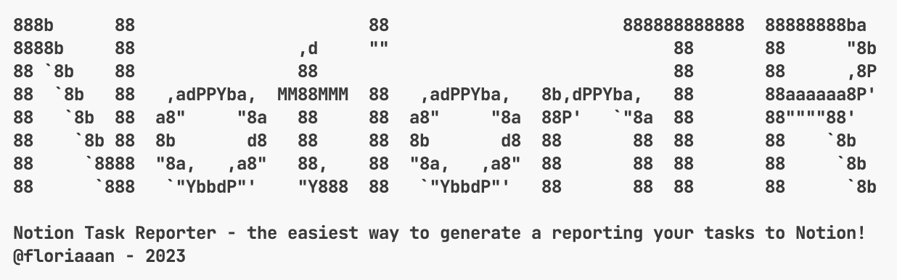

<div id="top"></div>

<p class="not-prose inline-flex items-center gap-x-2 w-full justify-center" align="center">
  <a href="https://github.com/floriaaan/notion-task-reporter/graphs/contributors"></a>
  <a href="https://github.com/floriaaan/notion-task-reporter/network/members"></a>
  <a href="https://github.com/floriaaan/notion-task-reporter/stargazers"></a>
  <a href="https://github.com/floriaaan/notion-task-reporter/issues"></a>
  <a href="https://github.com/floriaaan/notion-task-reporter/blob/master/LICENSE"></a>
  <a href="https://github.com/floriaaan/notion-task-reporter/"></a>

</p>

<!-- PROJECT LOGO -->
<br />
<div align="center">
  <a href="https://github.com/floriaaan/notion-task-reporter">
    
  </a>
  <p align="center">
    NotionTR (Notion Task Reporter) is an utility that easily allows you to generate a reporting of your tasks in Notion.
    <br />
    <a href="https://github.com/floriaaan/notion-task-reporter"><strong>Explore the docs »</strong></a>
    <br />
    <br />
    <!-- <a href="https://github.com/floriaaan/notion-task-reporter">View Demo</a>
    · -->
    <a href="https://github.com/floriaaan/notion-task-reporter/issues">Report Bug</a>
    ·
    <a href="https://github.com/floriaaan/notion-task-reporter/issues">Request Feature</a>
  </p>
</div>

<!-- TABLE OF CONTENTS -->
<details>
  <summary>Table of Contents</summary>
  <ol>
    <li>
      <a href="#about-the-project">About The Project</a>
      <ul>
        <li><a href="#built-with">Built With</a></li>
      </ul>
    </li>
    <li>
      <a href="#getting-started">Getting Started</a>
      <ul>
        <li><a href="#prerequisites">Prerequisites</a></li>
        <li><a href="#installation">Installation</a></li>
      </ul>
    </li>
    <li><a href="#roadmap">Roadmap</a></li>
    <li><a href="#contributing">Contributing</a></li>
    <li><a href="#license">License</a></li>
  </ol>
</details>

<!-- ABOUT THE PROJECT -->

## About The Project

[![Product Name Screen Shot][product-screenshot]](https://github.com/floriaaan/notion-task-reporter)

NotionTR (Notion Task Reporter) is an utility that easily allows you to generate a reporting of your tasks in Notion.

The project was created to help me generate a weekly report of my tasks in Notion, but it can be used for any other purpose.
It can be used with any Notion input database, as long as it has the [following properties](./src/lib/notion/task.ts):

- a `name` property: a text property with the name of the task,
- a `assigné` property: a multi-select property with the users assigned to the task,
- a `date` property: a date property with the date of the task (from-to supported),
- a `projet` property: a select property with the project of the task (used to group tasks by project),
- a `état` property: a select property with the status of the task (used to filter tasks by status),
- a content: the content of the task (**optional**, used to describe the task).

We will provide a template database in the future, and a way to customize the properties.

---

### Features

NotionTR is a CLI tool, designed to be used with a cron job.
It can generate a report in two formats:

- markdown (returns Notion blocks),
<!-- - html (returns a html file, NOT RIGHT NOW BUT WHY NOT). -->
- ai (with OpenAI's autocomplete, returns Notion paragraph).

---

### Built With

- [![Typescript][typescript]][ts-url]
- [![Node.js][nodejs]][nodejs-url]
- [![Notion][notion]][notion-url]

<p align="right">(<a href="#top">back to top</a>)</p>

<!-- GETTING STARTED -->

## Getting Started

This is an example of how you may give instructions on setting up your project locally.
To get a local copy up and running follow these simple example steps.

### Installation

1. Clone the repo
   ```sh
   git clone https://github.com/floriaaan/notion-task-reporter.git
   ```
2. Install NPM packages

   ```sh
   npm install # yarn install, pnpm install
   ```

3. Provide your environnement variables (optional if passing them as arguments)

   ```sh
   cp .env.example .env
   ```

   Then fill the `.env` file with your Notion API Token and input/output database ids.

### Usage

- Launch NotionTR : `pnpm start`
- Launch NotionTR with arguments : `pnpm start --type=(ai|markdown)`
- Show supported parameters : `pnpm start --help`

<p align="right">(<a href="#top">back to top</a>)</p>

<!-- ROADMAP -->

## Roadmap

- [ ] Add complete support for environments variables as arguments
- [ ] Add support for multiple databases in input
- [ ] Add workflow to build and release binaries for all platforms
- [ ] Add support for other output formats (JSON, CSV, etc.)

See the [open issues](https://github.com/floriaaan/notion-task-reporter/issues) for a full list of proposed features (and known issues).

<p align="right">(<a href="#top">back to top</a>)</p>

<!-- CONTRIBUTING -->

## Contributing

Contributions are what make the open source community such an amazing place to learn, inspire, and create. Any contributions you make are **greatly appreciated**.

If you have a suggestion that would make this better, please fork the repo and create a pull request. You can also simply open an issue with the tag "enhancement".
Don't forget to give the project a star! Thanks again!

1. Fork the Project
2. Create your Feature Branch (`git checkout -b feature/amazing-feature`)
3. Commit your Changes (`git commit -m 'feat: add amazing feature'`)
4. Push to the Branch (`git push origin feature/amazing-feature`)
5. Open a Pull Request

<p align="right">(<a href="#top">back to top</a>)</p>

<!-- LICENSE -->

## License

Currently, this project has no license. Feel free to use it as you want.

<p align="right">(<a href="#top">back to top</a>)</p>

<!-- MARKDOWN LINKS & IMAGES -->
<!-- https://www.markdownguide.org/basic-syntax/#reference-style-links -->

[contributors-shield]: https://img.shields.io/github/contributors/floriaaan/notion-task-reporter.svg
[contributors-url]: https://github.com/floriaaan/notion-task-reporter/graphs/contributors
[forks-shield]: https://img.shields.io/github/forks/floriaaan/notion-task-reporter.svg
[forks-url]: https://github.com/floriaaan/notion-task-reporter/network/members
[stars-shield]: https://img.shields.io/github/stars/floriaaan/notion-task-reporter.svg
[stars-url]: https://github.com/floriaaan/notion-task-reporter/stargazers
[issues-shield]: https://img.shields.io/github/issues/floriaaan/notion-task-reporter.svg
[issues-url]: https://github.com/floriaaan/notion-task-reporter/issues
[license-shield]: https://img.shields.io/github/license/floriaaan/notion-task-reporter.svg
[license-url]: https://github.com/floriaaan/notion-task-reporter/blob/master/LICENSE
[coverage-shield]: https://codecov.io/gh/floriaaan/notion-task-reporter/branch/develop/graph/badge.svg?token=140LKRPY5O
[coverage-url]: https://github.com/floriaaan/notion-task-reporter/
[product-screenshot]: ./docs/images/screenshot.png
[notion]: https://img.shields.io/badge/Notion-000000?logo=notion&logoColor=white
[typescript]: https://img.shields.io/badge/TypeScript-007ACC?logo=typescript&logoColor=white
[nodejs]: https://img.shields.io/badge/Node.js-339933?logo=node.js&logoColor=white
[ts-url]: https://www.typescriptlang.org/
[nodejs-url]: https://nodejs.org/en/
[notion-url]: https://www.notion.so/
